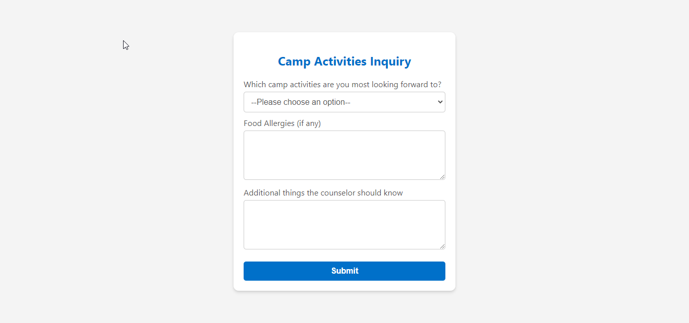
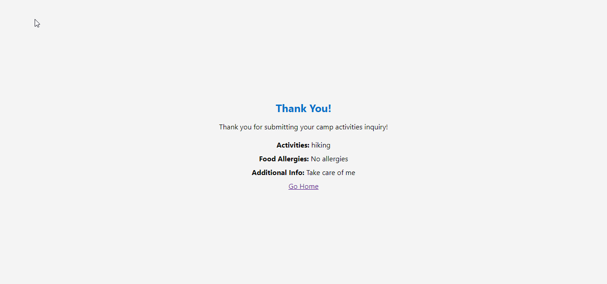

# Camp Activities Inquiry Web Application

This web application allows users to submit inquiries about camp activities. Users can select their preferred activities, provide information about any food allergies, and share additional details for camp counselors to know.

  

  

## How to Use

1. **Fill out the Camp Activities Inquiry Form**
    - Open `index.html` in a web browser.
    - Fill out the form with your preferences for camp activities, any food allergies you have, and any additional information you want to share with the camp counselors.
    - Click the "Submit" button to submit the form.

2. **View Thank You Page**
    - After submitting the form, you will be redirected to the `thankyou.html` page.
    - The Thank You page will display the submitted information.
    - Link to redirect to the homepage.

### Files

- `index.html`: Contains the HTML markup for the Camp Activities Inquiry form.
- `thankyou.html`: Contains the HTML markup for the Thank You page.

### Technologies Used

- HTML5
- CSS3
- JavaScript

### How Data Submission Works

- When the form is submitted, JavaScript intercepts the submission and prevents the default form submission behavior.
- Form data is collected and stored in the browser's `localStorage` object.
- Users are then redirected to the Thank You page (`thankyou.html`), where the stored form data is retrieved from `localStorage` and displayed on the page.
- After retrieving the form data, it is removed from `localStorage` to ensure it is not stored longer than necessary.

## Creator

Designed by [Ethern Myth](https://github.com/Ethern-Myth)
